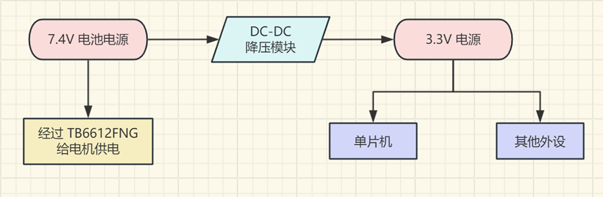
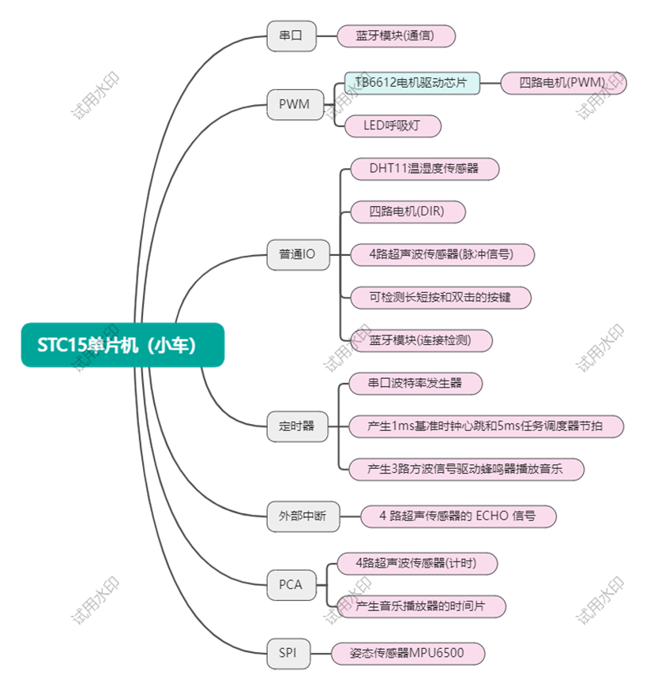

# 小车设计报告

## 一、主控芯片

主控芯片选用 **IAP15W4K61S4**。

IAP15W4K61S4 芯片属于 **STC15W4K32S4 系列** 芯片，采用 **8051 架构**。其主要特点如下：

1. 具有 **4KB SRAM、61KB FLASH**  
2. 工作电压范围宽：**2.5V ~ 5.5V**  
3. 无需外部晶振；内置复位电路。
4. 片上资源有：
   1. 5 个 16 位可自动重装载的定时/计数器  
   2. 5 个外部中断  
   3. 4 组独立串口  
   4. 1 组 SPI 接口  
   5. 8 路 10 位 A/D 转换器  

芯片封装为 **PDIP-40**（双列直插式），具有 **38 个 IO 口**（除 VCC 和 GND 外），以便直接插入面包板使用。

---

## 二、硬件选型

### 1. 电源：7.4V 18650 锂电池（3000 mAh）

根据题目要求，电源需要有足够的容量和电压以驱动电机。18650 锂电池满足要求。

### 2. 降压模块：LM2596S 可调降压模块

使用 **LM2596S DC-DC 模块**，将电池电压（**7.4V**）降至 **3.3V**，为单片机和低电压模块供电。

### 3. 电机：金属齿轮 TT 减速电机

该电机额定电压为 **6V**，工作电压范围 **1.5V~9V**，与供电系统匹配。

### 4. 电机驱动模块：TB6612FNG

一个TB6612模块可以驱动**2**路电机，其允许输入的电机电压范围适配TT电机电压。（**3.3V供电**）

### 5. 超声传感器：HC-SR04

**3.3V 供电**

### 6. 蓝牙模块：大夏龙雀 BT37

**3.3V 供电**

### 7. 温湿度传感器：DHT11

**3.3V 供电**

### 8. 姿态传感器：MPU6500

**3.3V 供电**

---

## 三、电源设计

整车供电设计如下：

---

## 四、主控芯片外设分配

---

## 五、开发日志

### 2025年11月18日

#### 编译器的 Overlay 问题

问题：程序通过编译，正常下载，但是不运行。

问题分析排查：开始了艰苦漫长的查资料和尝试。

问题突破：通过“注释法”发现，一条根本就没有执行到的语句，其存在与否竟然会影响程序能否运行。

问题深入：继续如黑夜中摸索般地查资料和尝试，最终找到问题产生的原因。大致描述如下：

> 当 Keil C51 编译器的优化等级 >= 2 (Data overlaying) 时，编译器会根据所有函数之间的调用关系生成一个
> 树结构，并可能将编译器认为的没有相互调用关系的函数，其内部变量分时复用在同一个物理地址上。该技术是为了
> 了应对 8051 内核单片机内存小的劣势而函数指针这种间接调用函数的方式不能被编译器识别，
> 这就导致编译器错误地将可能同时需要使用的变量放在了同一个内存地址，在程序运行时产生冲突。

问题解决：将函数指针用宏定义的形式替换，或佯调用通过函数指针调用的函数。

问题总结和反思：我们曾在程序中多处使用函数指针，追求程序接口的简洁可读，但我们失望地看到，  
受限于 8051 单片机古老的内核限制，我们不被允许使用函数指针等现代的封装技巧。在开发特定型号的芯片时，  
我们应当在熟悉编程禁忌的基础上编写代码，否则容易被古老的潜规则所惩罚，被莫名其妙的限制所束缚，  
被“明明没有任何问题”的表象所迷惑，在理论与现实之间的矛盾的南墙上撞得头破血流。
